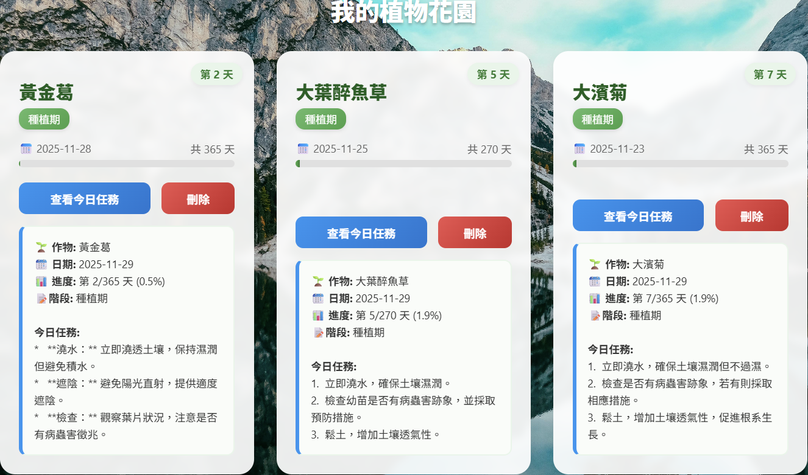
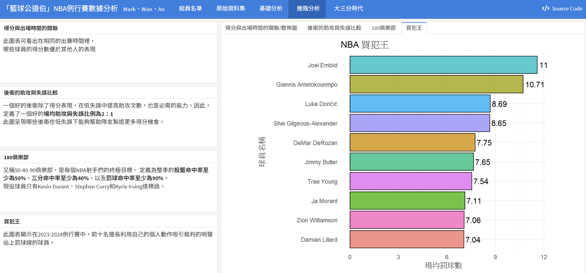

# 張梓閎｜Backend / Software / AI Intern

● Birthday：2003/11/22

● Education：國立高雄大學 資訊管理學系(2022/09 – 2026/06)

● Location：New Taipei City

● E-mail：mark20031122@gmail.com

● Mobile：0975-901-492

---

## About Me

大家好，我是張梓閎，目前就讀國立高雄大學資訊管理學系四年級。我認為自己**做事謹慎、按部就班**，也清楚自己在團隊中應扮演的角色。在團隊中，我不一定是最外向或最搶眼的人，但通常會扮演讓事情順利推進的角色，像是整理資訊、釐清需求，或協助大家把零散的想法整合成可執行的方向。
除了踏實之外，我也具備強烈的責任感與自我要求。面對交付的任務，我不會只追求**做完**，而是希望能**做好**。在學習新技術時，我會花時間把概念理解透徹後再動手實作，遇到問題就慢慢找原因解決。這樣的做事方式雖然不算快，但能讓我在程式撰寫、系統操作或資料處理上，累積比較穩定的基礎。

---

## Interests & Motivation

- 打籃球、看電影、看運動比賽
- 熱愛程式設計與技術實作  
- 享受分析問題、拆解問題與解決問題的過程  
- 樂於嘗試新工具、新技術，並應用於實際專案中  

希望能透過實習累積實務經驗，強化抗壓性與應變能力，將每一次挑戰轉化為成長的養分。

---

## Skills

### Programming Languages
- **Python**
- **Java**
- **C**
- **PHP**
- **R**

### DataBase
- MySQL(有資料庫使用經驗且了解基本語法）

### AI
基礎機器學習、深度學習套件使用：

- **Scikit-learn**
- **PyTorch**

---

## Projects

### 園藝智能助理（畢業專題）

<table>
  <tr>
    <td></td>
    <td></td>
  </tr>
</table>

- 整合土壤濕度與環境溫溼度感測器，即時監測植物狀態
- 根據感測數據自動控制澆水裝置
- 架設API串接雲端資料庫，自動收集與整理資料
- 透過AI模型分析不同植物需求，提供照護建議
- 建置植物資料庫

我負責的工作是**植物資料庫和網頁建置**：
- 建置台灣常見100種植物資料庫：整理植物基礎資訊與照護需求，統一資料格式 
- 規劃資料欄位如植物名稱、日照需求、澆水頻率等，提升查詢與後續AI分析的可用性  
- 製作植物資料展示頁面，將資料以網頁形式呈現，提供使用者快速瀏覽、比對與尋找植物相關資訊  
- 與系統整合，讓資料可被前端和後端功能使用，作為後續訓練AI的基礎資料來源 

**Live Website:** https://plantai-cac82.web.app  

### 籃球公道伯｜NBA 2023–2024 例行賽數據分析（R / Flexdashboard）

「籃球公道伯」是一個以 **2023–2024 NBA 例行賽球員數據**為基礎的資料分析專案。  
因為平常很喜歡打籃球，我就想把**看球的直覺**變成**用資料說話**，所以使用 **R語言**抓取Basketball-Reference的公開資料，透過各種圖表呈現球員表現與現代籃球趨勢。

 **分析內容與圖表**

 1) 基礎分析：Top 10 得分王、Top 100 players得分文字雲、年齡分布、位置分布
 2) 進階分析：上場時間 vs 得分效率、助攻 vs 失誤看控衛價值、180俱樂部、Top 10 買犯王
 3) 大三分時代：各位置三分出手數/總出手數、各位置三分表現、FG% vs eFG%、空間型中鋒得分結構

**Technologies:** R, Flexdashboard, rvest, ggplot2, wordcloud2, plotly  

**Live Dashboard:** https://markkkkkkkkkkkkkkkkkkkkkk.github.io/Resume/DAV%E7%B1%83%E7%90%83%E5%85%AC%E9%81%93%E4%BC%AF.html#%E5%A4%A7%E4%B8%89%E5%88%86%E6%99%82%E4%BB%A3

---

## Team Experience

### 系籃隊隊長
- 負責平常訓練安排與顧及隊友的狀況
- 在比賽壓力與突發狀況下做出即時決定
- 知道每位隊友的優點，學習如何將他們放在最適合的位置，發揮實力

### 系上活動支援 / 新生宿營隊輔
- 協助活動執行、拍攝與現場支援
- 與不同背景的人合作，提升溝通與應變能力

---

## Language Skills

- **English**
  - TOEIC：800
  - GEPT：中級
  - 能閱讀英文技術文件，並進行基本商務溝通

---

## Experience

### 外場工讀生｜洪樓小館（台北市士林區）
**2023/07 – 2023/08**
- 負責外場的工作
- 在尖峰時段保持效率與穩定度
- 培養責任感與抗壓能力

---

## Career Goal

希望能在後端工程、系統開發或AI相關實習中：
- 持續精進技術能力
- 從實務中學習系統思維
- 成為一位**穩定、可靠、能被信任的工程師**

